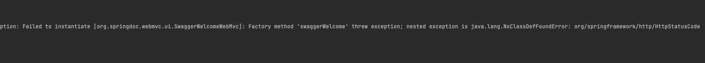
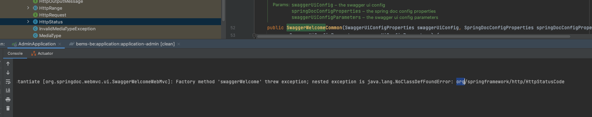
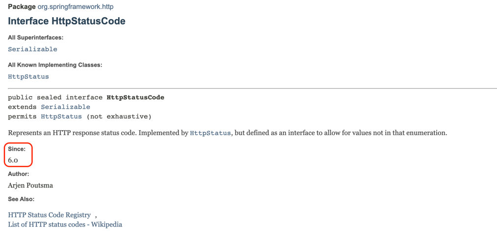
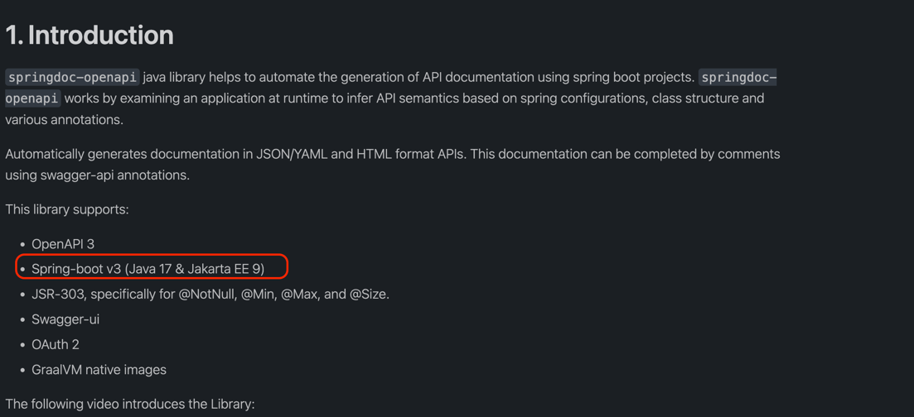

# SpringDoc 2.X.X java.lang.NoClassDefFoundError: org/springframework/http/HttpStatusCode 에러 발생 해결법








버전이 SpringBoot 3.0 용인것 같다



```groovy
//Swagger
implementation 'org.springdoc:springdoc-openapi-ui:1.6.14'
implementation 'org.springdoc:springdoc-openapi-webmvc-core:1.6.14'
```

결론 문서를 잘읽자..