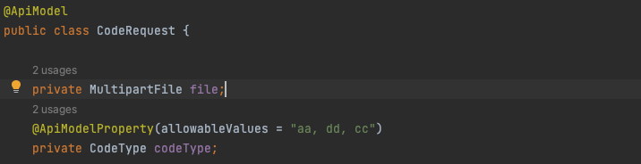
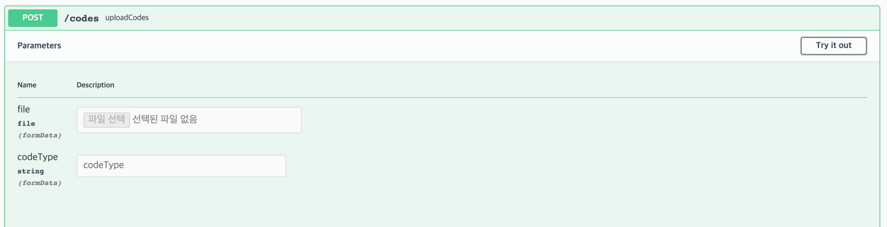
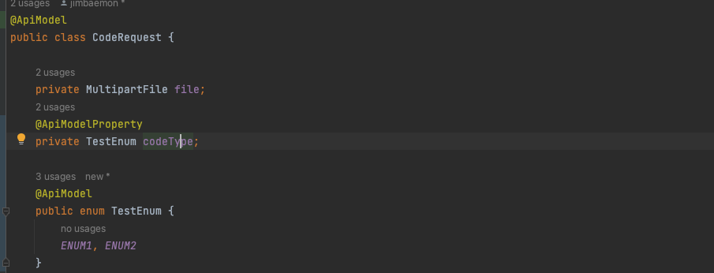
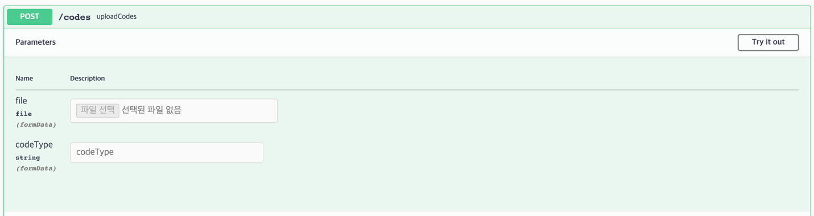
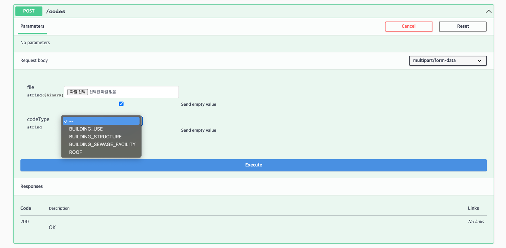
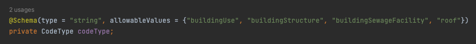
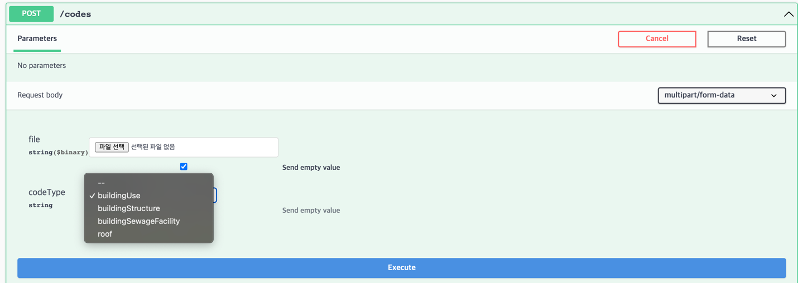
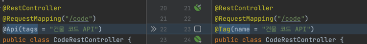
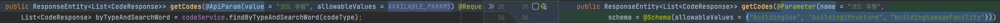

# Springfox를 사용하면서 발생한 어려움

SpringFox 를 이용해서 생성한 Multipart 방식의 Post 에서 enum 이 String 타입으로 지정되어서

API 사용자가 어떠한 값으로 요청해야 하는지가 불분명한 상황이 발생





---
## 문제를 해결하기 위한 자료 조사 및 결과

동일한 문제 항목에 대한 응답 없음

https://github.com/springfox/springfox/issues/3607

https://stackoverflow.com/questions/69246859/document-a-multipart-form-data-endpoint-with-springfox

비슷한 문제에 대한 상담결과 적용해 보니 안됨

https://stackoverflow.com/questions/74347831/springboot-with-swagger-for-a-multipart-form-data-show-all-enum-possible-values





Springfox 오픈소스 활성도 자체가 많이 떨어져 보였다. 마일스톤 선정 자체가 2020년 위주

https://github.com/springfox/springfox/milestone/45

직접 api문서를 수정할 수 있는 방안을 조사중이나 마땅치 않음...


---

## 문제점 해결 방안
문제점 해결을 위해 적용할 수 있는 방안으로는

1. 오픈소스에 직접 참여해서 에러를 수정하는 방식
2. SpringDoc openApi로 라이브러리 변경.

### 1. 오픈 소스에 직접 차여해서 에러를 수정하는 방식
#### 장점
* 오픈소스 참여 경험
* 문서를 생성하는 내부적인 방법을 파악해서 스스로에 대한 발전

#### 단점
* 비즈니스 개발을 위한 도구를 수정하는 개발을 업무에 하게 되면 자원 낭비
* 2020년 이후 개선이 없는 오픈소스여서 내가 수정한 소스가 반영될지 미지수

### 2. SpringDoc OpenApi 로 라이브러리 변경
#### 장점
* 오픈소스가 활성화 되어 있음
* Reactive, SpringBoot 3.0 등 다양한 환경에서 사용 가능한 확장성
* Springfox Migration 가이드 제공
#### 단점
* 기존 Springfox에서 Migration 작업 필요


---
## SpringDoc Api로 라이브러리 변경 여부 고려 
### 1. 현행 문제인 Enum 으로 Multipart 항목이 정상적으로 나오는지 확안
Springdoc openApi 1.6.14 적용

```groovy
//Swagger
implementation 'org.springdoc:springdoc-openapi-ui:1.6.14'
implementation 'org.springdoc:springdoc-openapi-webmvc-core:1.6.14'
```

기존 Springfox에서 사용하던 어노테이션 임시 제거

결과 확인

**Enum 정상 적용 여부**



**임의 Select 제공 가능 여부**





### 2. Migration 가능 여부 확인
SpringDoc 홈페이지에서 제공하는 방법

https://springdoc.org/#migrating-from-springfox
```
@Api → @Tag

@ApiIgnore → @Parameter(hidden = true) or @Operation(hidden = true) or @Hidden

@ApiImplicitParam → @Parameter

@ApiImplicitParams → @Parameters

@ApiModel → @Schema

@ApiModelProperty(hidden = true) → @Schema(accessMode = READ_ONLY)

@ApiModelProperty → @Schema

@ApiOperation(value = "foo", notes = "bar") → @Operation(summary = "foo", description = "bar")

@ApiParam → @Parameter

@ApiResponse(code = 404, message = "foo") → @ApiResponse(responseCode = "404", description = "foo")
```

#### 예시





---
## 결정사항 및 반성
### 결정사항
* SpringDoc 으로 버전 변경 결정 및 팀원분들께도 적용 요청


