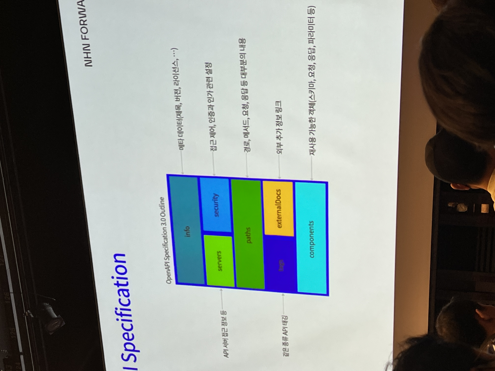

# API 설계 우선 접근 방식 [14:00]

* API 우선 방식이란?
* API 설계 우선 방식?
* OpenAPI Spec
* 시행과 착오
  * 용어 통일
  * 문서 관리
  * 기능 확장
  * 오류

## API 우선방식이란?

* API-first
  * *-first 제일 중요한 자산 -> API-first API 를 가장 우선식 하는 방식
  * Mobile first 나 AI First 나 API-first 개념 적립이 우선시 되야 한다.
* API-First vs Code-First
  * API : 서비스를 성공 시키기 위한 전략
  * Code : API는 기능을 제공하기 위한 전술
  * Code-first 방식은 API를 단순이 수단으로 여기나 API-first는 목표를 위한 틀로써 전략으로써 사용됨

## API 설계 우선 [API Design-first]

* API-frist 의 방법론
* Contract
  * API 설계는 계약이다. 
  * 모두의 계약이 없이는 다음 단계로 진행하지 않는다. [기획자나 운영팀과도 협의를 통해 진행하는가?]
* 장점
  * 업무 효율 상승
  * 개발자 경험 개선
  * 상호 운영 능력 개선
  * 비용절감

## Open Api Specification

* Human & Machine Readable
  * 이해 관계자
* 

## 시행과 착오

* 용어 통일
  * to, receiver, recipient = 수신자
* API 설계 문서 관리
  * JSON Ref 를 통한 문서 분리
  * 버전별 관리
* 확장
  * OpenAPI
    * x-* 값을 통해 문서 확장 가능
  * mustach(문서 자동화 툴) -> 코드 Generator 자동화로 쓰기 괜찮아 보임

NHN 메시지 팀에서는 OpenAPI Specification 을 문서화 하고 API Generator 를 통해 코드를 작성하는것 같다. 왜?

