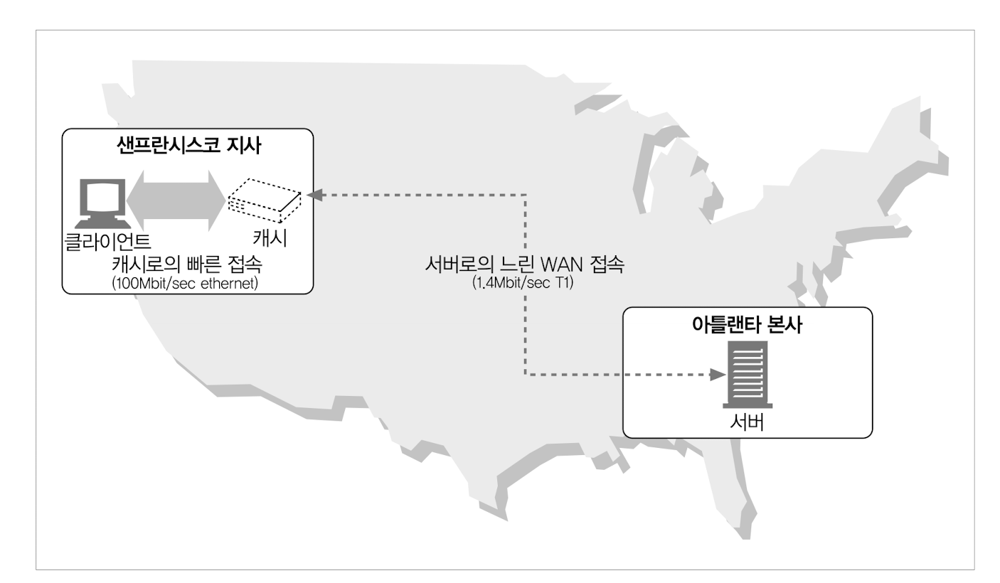

# 7장 캐시

> 자주 쓰이는 문서의 사본, 캐시된 문서가 존재한다면, 문서를 원 서버가 아닌 캐시로 부터 제공하는 기능

## 장점 4가지

* 불필요한 데이터 전송을 줄여서, 네트워크 비용 감소
* 네트워크 병목 감소로 인한 속도 증가
* 원 서버에 대한 요청 감소로 부하 감소
* 요청 거리 감소로 인한 지연 속도 감소

## 7.1 불필요한 데이터 전송

* 캐시가 없을 시 원 서버는 같은 문서를 클라이언트가 요청 하는 만큼 재 전송 해줘야 한다.
* 캐시가 있을 경우 같은 문서에 대한 응답을 캐시로 처리 할 수 있어서 낭비를 줄여 준다.

## 7.2 대역폭 병목

* 클라이언트가 서버에 접속할 경우 속도는 그 경로에 있는 가장 느린 네트워크의 속도와 같다.
* 로컬 네트워크에 캐시된 자료를 가지고 있다면 병목에 대한 이득을 가져올 수 있다.

## 7.3 갑자스러운 요청 쇄도(Flash Crowds)

* 갑작 스러운 요청 쇄도로 트래픽 급증은 네트워크와 웹 서버의 심각한 장애를 야기 시킬수 있으므로 캐시는 중요하다

## 7.4 거리로 인한 지연

* 빛의 속도로 통신 하더라도, 거리로 인하여 지연이 발생 할 수 있다.  4,400km 기준 30 밀리초... (의미가 있나???) 
* 근처에 캐시서버가 있다면 거리를 줄여서 이러한 지연 속도 역시 방지 할 수 있다.

## 7.5 적중과 부적중

* **캐시적중(cache hit)**
  캐시에 요청이 도착했을때 사본이 있다면 캐시 적중
* **캐시부적중(cache miss)**
  사본이 없어서 원서버에 요청하는 경우 캐시 부적중