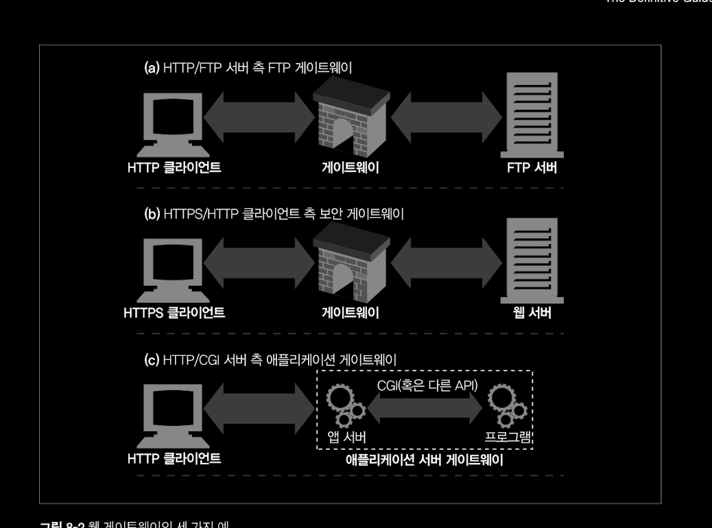
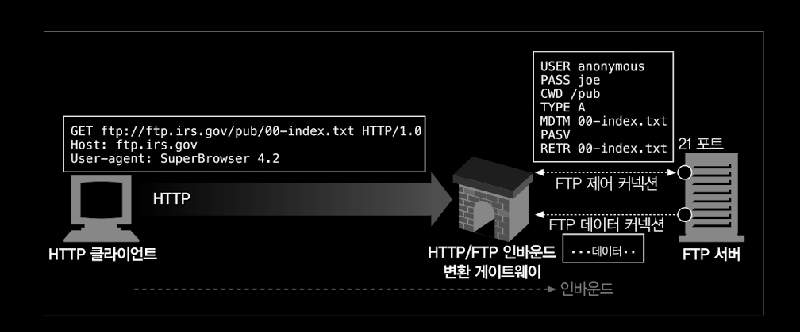
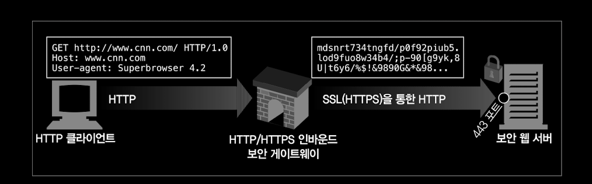
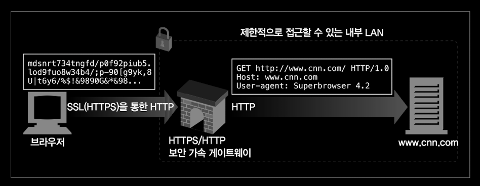
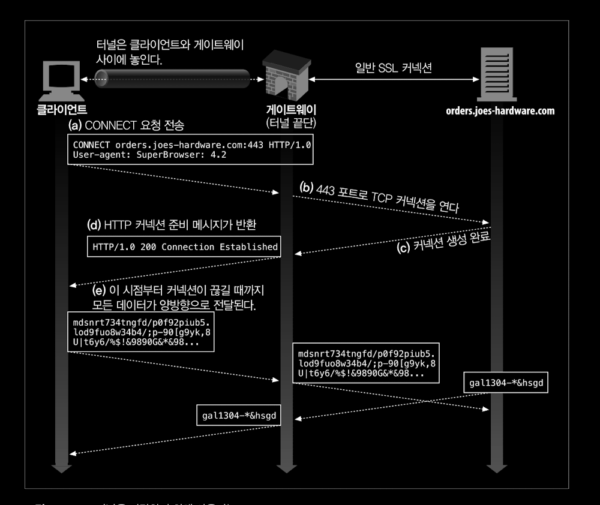
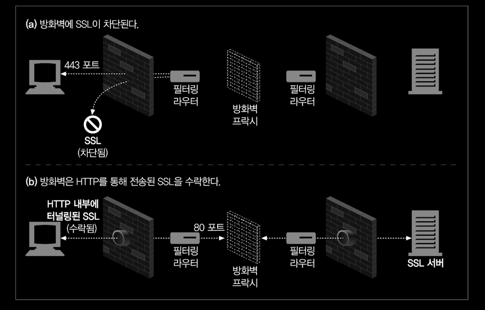
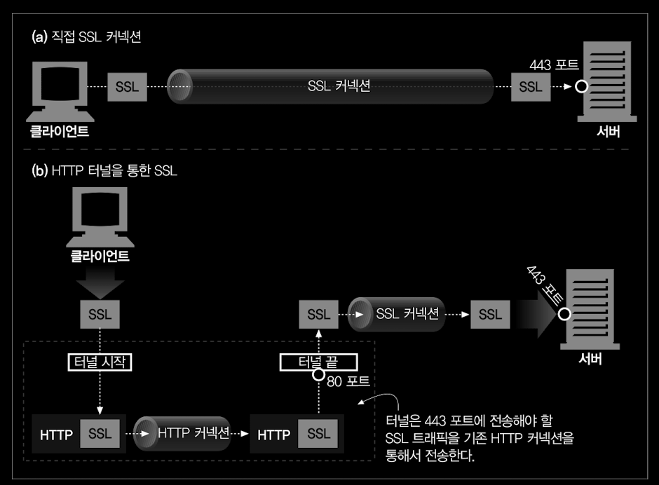
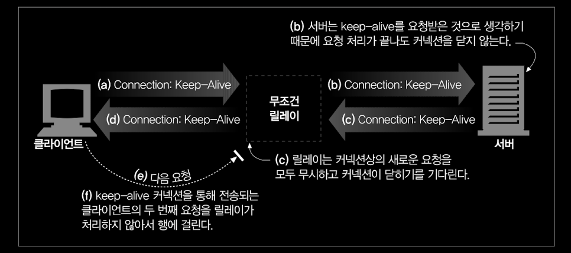

# 8장 통합점 : 게이트웨어, 터널, 릴레이

> HTTP 를 정적인 문서 뿐만 아닌 다양한 리소스를 공유하는데 사용하기 위하여 어떻게 사용할 수 있는지 알아본다.

* 게이트웨이 : 서로 다른 프로토콜과 애플리케이션 간의 HTTP 인터페이스
* 어플리케이션 인터페이스 : 서로 다른 형식의 웹 애플리케이션이 통신하는 데 사용
* 터널 : HTTP 커넥션을 통해서 HTTP가 아닌 트래픽을 전송하는 데 사용
* 릴레이 : HTTP 프락시로, 한 번에 한개의 홉에 데이터를 전달하는데 사용

## 8.1 게이트웨이

* 게이트웨이란 서로 다른 프로토콜 간의 인터페이스

* 웹에 더 복잡한 리소스를 처리 하기 위한 방법으로 게이트웨이가 활용 되었다.

  

### 8.1.1 클라이언트 측 게이트웨이와 서버측 게이트웨이

* 게이트웨이는 기본적으로 다른 프로토콜 간의 통신이므로 클라이언트 측과 서버측 프로토콜을 '/' 빗금으로 표시한다 {클라이언트프로토콜}/{서버프로토콜}
* HTTP 프로토콜을 클라이언트 측에서 사용하면 클라이언트 측 게이트웨이고 반대면 서버 측 게이트 웨이다

## 8.2 프로토콜 게이트웨이

* 대리 프록시와 같이 게이트웨이도 웹서버 앞에서 클라이언트의 요청이 거쳐가게 할 수 있다.

### 8.2.1 HTTP/* : 서버 측 웹 게이트웨이

* 클라이언트 측 요청이 서버 영역에서 다른 프로토콜로 전환된다.

  

### 8.2.2 HTTP/HTTPS: 서버 측 보안 게이트웨이

* 내부 트래픽 보안 목적

### 8.2.3 HTTPS/HTTP : 클라이언트 측 보안 가속 게이트웨이

* 내부 트래픽 가속 목적

## 8.3 리소스 게이트웨이

* 가장 일반적인 형태인 애플리케이션 서버
* 목적지 서버와 게이트 웨이를 한 개의 서버로 결합 

### 8.3.1 공용 게이트웨이 인터페이스

* 리소스 게이트웨이 형태로 초기에는 CGI[공용 게이트웨이 인터페이스]를 사용 하였다.

### 8.3.2 서버 확장 API

* CGI는 서버 자체의 동작을 바꾸거나 서버의 처리능력을 올리는데 무리가 있어서 HTTP 와 직접 연결할 수 있는 서버 확장 API 를 이용한다.

## 8.4 애플리케이션 인터페이스와 웹서비스

* 8.3 에서 논의한 바와 같이 리소스 게이트웨이를 통해 HTTP를 애플리키에션과 연결하는데 사용하기 적합하다는 결과가 나옴.
* 하지만 HTTP 헤더로 표현하기 힘든 정보를 추가로 교환하기 위해 HTTP 프로토콜에 RPC 나 XML 을 추가하는 방법 등이 있다.
* HTTP 를 이용하여 XML 데이터 객체를 주고 받는 SOAP 표준이 있다.

## 8.5 터널링 

> HTTP 커넥션을 통해서 HTTP가 아닌 트래픽을 전송하는 데 사용

### 8.5.3 SSL 터널링

* SSL 통신을 하고 싶으나 방화벽이 SSL 을 지원하지 않는 경우 HTTP 터널링을 이용하면 가능하다.

## 8.6 릴레이

* HTTP 명세를 준수하지 않는 HTTP 프락시 (쓰레기 아닌가??)
  * 프락시 만들어 놓고 문제 생기면 릴레이 라고 뻥치는 용도??
* 실제로 문제가 있다.

## 번외 RPC 동작 방식

