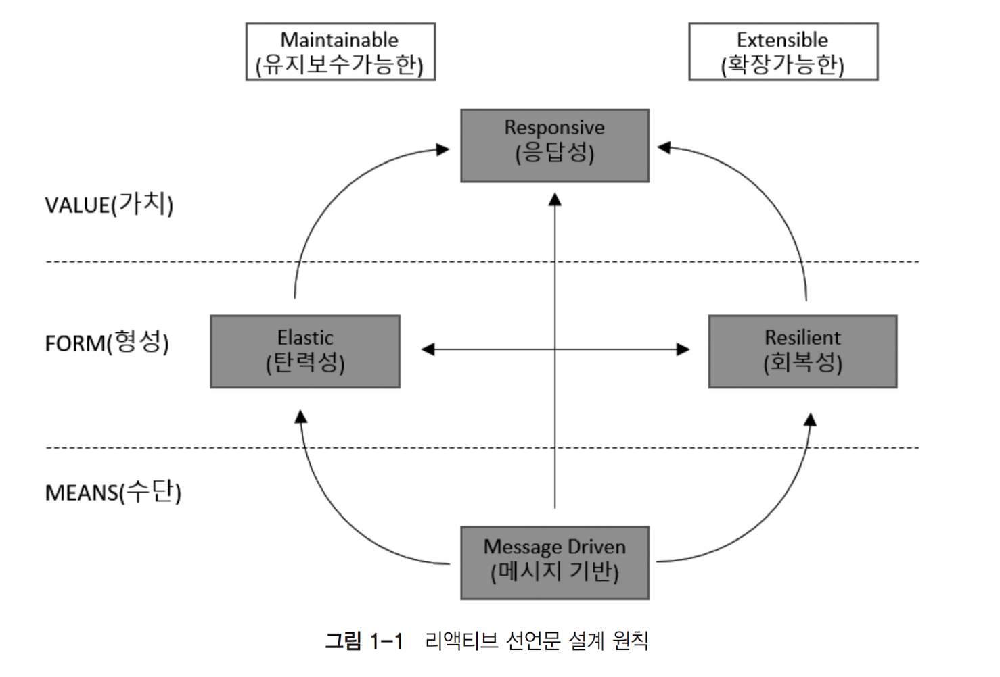

# 리액티브 프로그래밍
## 1. 리액티브 시스템과 리액티브 프로그래밍
### 1.1 리액티브 시스템 이란?
* 리액티브란 특정 이벤트나 상황이 발생했을 때, 반응을 해서 그에 따라 적절하게 행동하는 것을 의미한다.
  * 리액티브 시스템은 클라이언트의 요청에 즉각적으로 응답해 주는 것을 의미함.


### 1.2 리액티브 선언문으로 리액티브 시스템 이해하기



**MEAN**

* 리액티브 시스템에서 주요 통신 수단 - 메시지 기반 통신

**FORM**

> 메시지 기반 통신을 통해서 어떠한 형태를 지는 시스템으로 형성되는지 보여줌

* 탄력성
  * 시스템 작업량이 변화하더라도 일정한 응답을 유지하는 것
  * 시스템 자원을 유동적으로 조절하여 작업량 변화에 대응하는 것
* 회복성
  * 장애가 발생하더라도 응답성을 유지하는 것
  * 시스템의 구성요소를 비동기 메시지 기반 통신을 이용해 느슨한 결합과 격리성을 보장하여 장애가 파생되지 않도록 하는 것

**VALUE**

* 회복성과 탄력성을 기반으로 한 응답성

리액티브 설계 원칙을 따르면 빠른 응답성을 바탕으로 유지보수와 확장이 용이한 시스템을 구축할 수 있다. (?)


### 1.3 리액티브 프로그래밍 이란?

> 리액티브 시스템을 구축하는 데 필요한 프로그램이 모델

* Non-Blocking I/O 통신


### 1.4 리액티브 프로그래밍의 특징

#### 1.4.1 Declarative Programming (선언형 프로그래밍)

* 동작을 구체적으로 명시하지 않고 목표 알려주는 것

#### 1.4.2 Data Stream와 The Propagation of Change

* 데이터의 흐름
* 지속적으로 데이터가 발생할 때마다 이벤트를 생성하여 데이터 전달


### 1.5 코드로 보는 명령형 프로그래밍 vs 선언형 프로그래밍

**명령형**

* 어떤 작업을 처리하기 위해 실행할 동작을 코드에 구체적으로 명시하는 방법
  * for(int number : numbers)
  * if(number > 6 && ...)
  * sum += number;

**선언형**

* 동작을 구체적으로 명시하 않고 목표만 선언
  * stream()
  * filter()
  * sum()


### 1.6 리액티브 프로그래밍 코드 구성

리액티브 프로그래밍 코드는 Publisher, Subscriber, Data Source, Operator 로 나뉜다.

**Publisher**

* 제공자로써 입력으로 들어오는 데이터를 제공하는 역할

**Subscriber**

* Publisher가 제공한 데이터를 전달받아서 사용하는 주체
* 데이터를 소비하는 소비자

**Data Source**

* Publisher의 입력으로 들어오는 데이터

**Operator**

* Publisher로부터 전달되는 데이터 가공처리를 담당


### 2. 리액티브 스트림즈(Reactive Streams)

#### 2.1 리액티브 스트림즈 란?

* 개발자가 리액티브 코드를 작성하기 위해 사용하는 라이브러리의 구현 표준 사양
* 리액티브 스트림즈의 구현체로는 RxJava, Reactor, Akka Streams, Java 9 Flow API 등이 있음

#### 2.2 리액티브 스트림즈 구성요소

**Publisher**

* 데이터 생성 통지(발행, 게시, 방출) 역할

**Subscriber**

* 구독한 Publisher로부터 통지된 데이터를 전달받아서 처리하는 역할

**Subscription**

* Publisher에 요청할 데이터 개수를 지정하고, 데이터 구독 취소하는 역할

**Processor**

* Publisher와 Subscriber의 기능을 모두 가지고 다른 Pusblisher를 구독하거나 구독 당할 수 있다.

#### 2.2.1 구성 요소별 동작 과정

1. 먼저 Subscriber는 전달받을 데이터를 구독(subscribe)
2. Publisher는 데이터를 통지할 준비가 되었음을 Subscriber에게 알린다(onSubscribe)
3. Subscriber는 전달받기 원하는 데이터의 개수를 Publisher에게 요청(Subscription.request)
4. Publisher는 요청받은 만큼의 데이터를 통지한다.
5. 위의 과정 반복
6. Publisher가 데이터 전송이 완료 되었으면 onComplete을 에러가 발생했으면 onError를 전달


### 2.3 코드로 보는 리액티브 스트림즈  컴포넌트

#### 2.3.1 Publisher

```
public interface Publisher<T> {
	public void subscribe(Subscriber<? super T> s);
}
```


#### 2.3.2 Subscriber

```
```


### 2.4 관련 용어

* **signal**

  * Publisher와 Subscriber 간에 주고받는 상호작용
    * onSubscribe, onNext, onComplete, onError 등을 Signal 이라 한다.

* **Demand**

  * Subscriber가 Publisher 에게 요청하는 데이터

* **Emit**

  * Pubisher가 데이터를 통지하는 것

* **Upstream/DownStream**

  * 아래와 같은 코드에서 just 밑에 filter는 DownStream 반대는 Upsteram

  * ```
    Flux
    	.just(1,2,3,4)
    	.filter(n -> n%2 == 0)
    	.subscribe(System.out::println);
    ```

* **Sequence**

  * Operator로 데이터의 연속적인 흐름을 정의한 것

* **Operator**

  * just, filter, map 과 같은 연산자

* **Source**

  * Data Source


### 리액티브 스트림즈 구현 규칙

#### Publisher 구현을 위한 주요 기본 규칙

1. Publisher가 Subscriber에게 보내는 onNext signal의 총 개수는 항상 해당 Subscriber의
   구독을 통해 요청된 데이터의 총 개수보다 더 작거나 같아야 한다.
2. Publisher는 요청된 것보다 적은 수의 onNext signal을 보내고 onComplete 또는 onError
   를 호출하여 구독을 종료할 수 있다.
3. Publisher의 데이터 처리가 실패하면 onError signal을 보내야 한다.
4. Publisher의 데이터 처리가 성공적으로 종료되면 onComplete signal을 보내야 한다.
5. Publisher가 Subscriber에게 onError 또는 onComplete signal을 보내는 경우 해당
   Subscriber의 구독은 취소된 것으로 간주되어야 한다.
6. 일단 종료 상태 signal을 받으면(onError, onComplete) 더 이상 signal이 발생되지 않아야
   한다.
7. 구독이 취소되면 Subscriber는 결국 signal을 받는 것을 중지해야 한다.


#### Subriber 구현을 위한 주요 기본 규칙

1. Subscriber는 Publisher로부터 onNext signal을 수신하기 위해 Subscription.request(n)
    를 통해 Demand signal을 Publisher에게 보내야 한다.
2. Subscriber.onComplete( ) 및 Subscriber.onError(Throwable t)는 Subscription 또는
    Publisher의 메서드를 호출해서는 안 된다.
3. Subscriber.onComplete( ) 및 Subscriber.onError(Throwable t)는 signal을 수신한 후 구
    독이 취소된 것으로 간주해야 한다.
4. 구독이 더 이상 필요하지 않은 경우 Subscriber는 Subscription.cancel( )을 호출해야 한다.
5. Subscriber.onSubscribe( )는 지정된 Subscriber에 대해 최대 한 번만 호출되어야 한다.


#### Subscription 구현을 위한 기본 규칙

1. 구독은 Subscriber가 onNext 또는 onSubscribe 내에서 동기적으로 Subscription.request
  를 호출하도록 허용해야 한다.
2. 구독이 취소된 후 추가적으로 호출되는 Subscription.request(long n)는 효력이 없어야 한다.
3. 구독이 취소된 후 추가적으로 호출되는 Subscription.cancel( )은 효력이 없어야 한다.
4. 구독이 취소되지 않은 동안 Subscription.request(long n)의 매개변수가 0보다 작거나 같
  으면 java.lang.IllegalArgumentException과 함께 onError signal을 보내야 한다.
5. 구독이 취소되지 않은 동안 Subscription.cancel( )은 Publisher가 Subscriber에게 보내는
  signal을 결국 중지하도록 요청해야 한다.
6. 구독이 취소되지 않은 동안 Subscription.cancel( )은 Publisher에게 해당 구독자에 대한
  참조를 결국 삭제하도록 요청해야 한다.
7. Subscription.cancel( ), Subscription.request( ) 호출에 대한 응답으로 예외를 던지는 것
  을 허용하지 않는다..
8. 구독은 무제한 수의 request 호출을 지원해야 하고 최대 2의 63승-1개의 Demand를 지원해야
  한다.


### 리액티브 스트림즈 구현체

* RXjava
* Project Reactor
* Akka Stream
* Java Flow API
